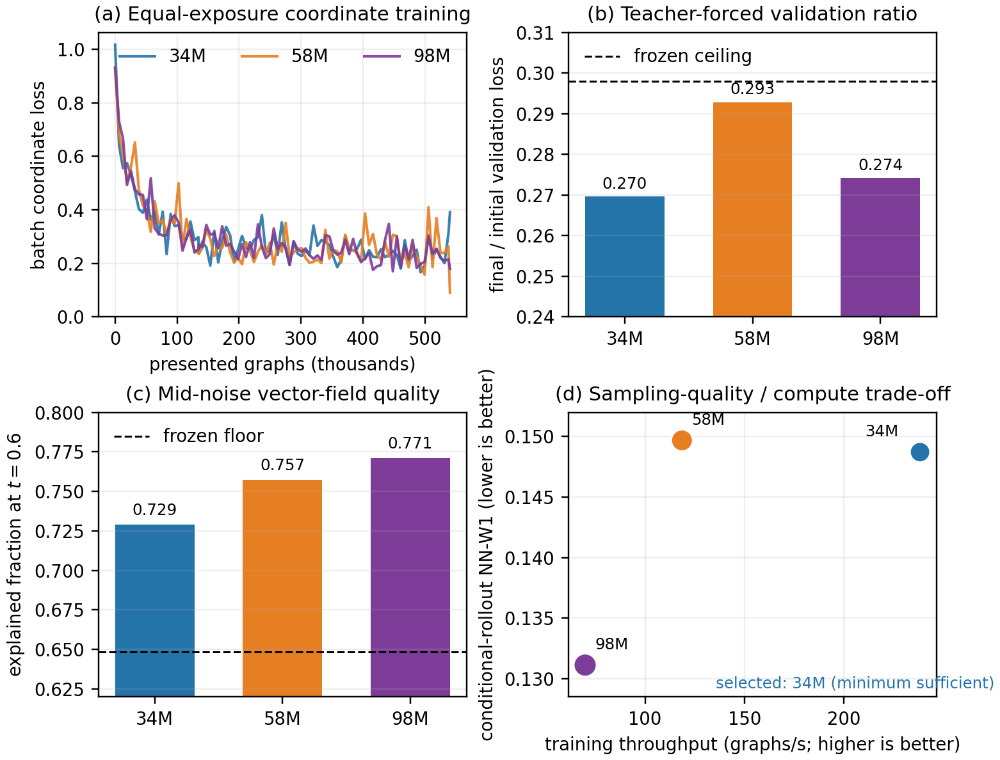
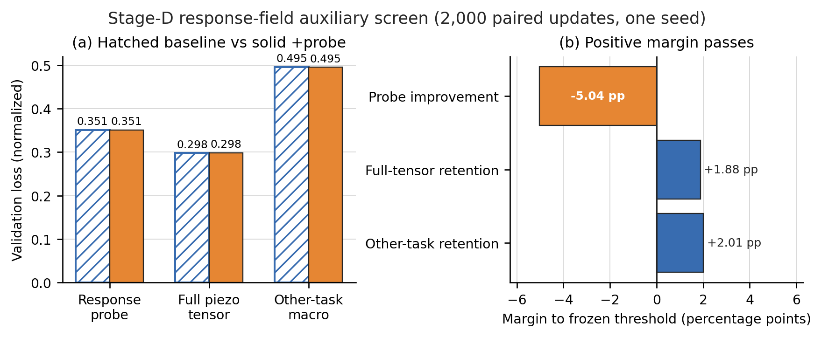
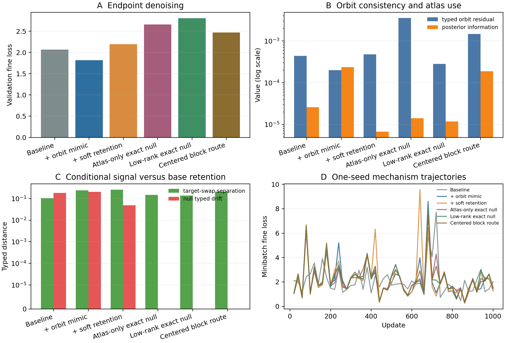
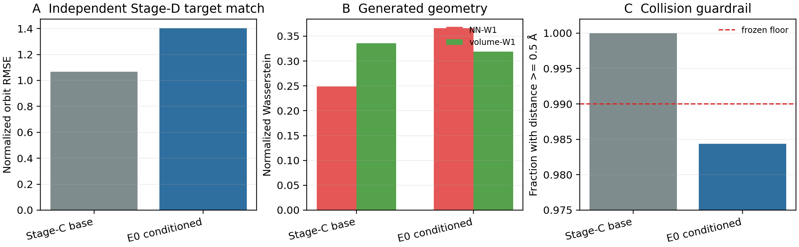
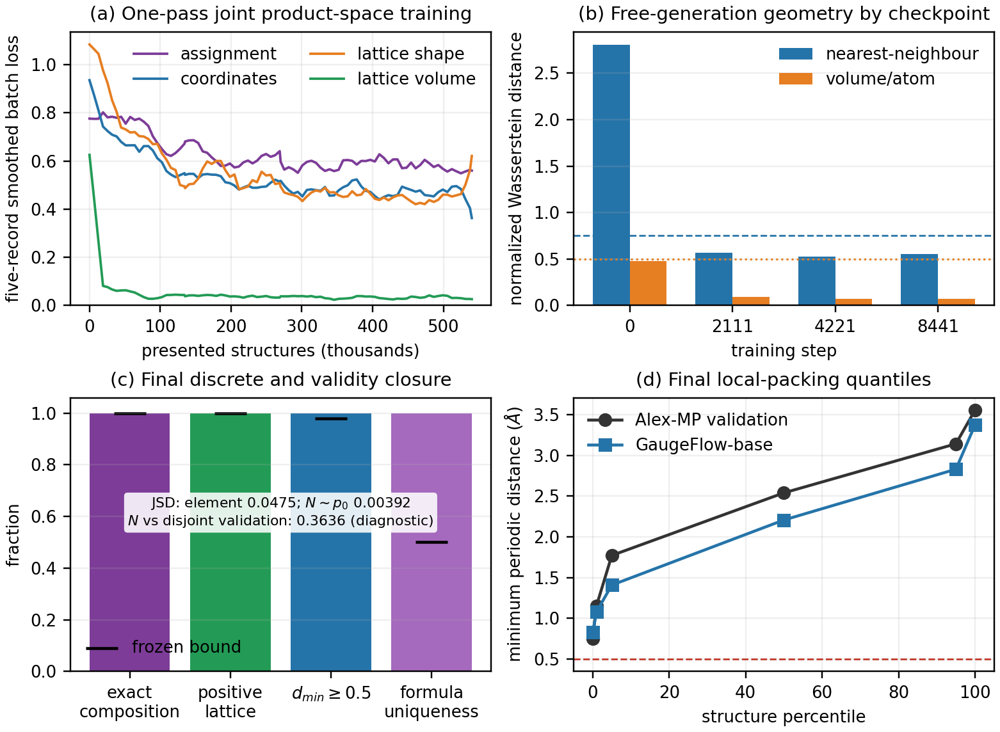

# GaugeFlow 当前实现、方法演进与实验状态（2026-07-24）

## 一句话结论

GaugeFlow 已经从早期连续 logit/ODE 原型重构为混合离散—连续晶体扩散框架，并完成 Cartesian tensor-orbit conditioner、反向采样软件闭环、H0 数据/群论资格化和 Alex-MP-20 全量 H1a cache。历史 independent-site free H1a 的局部 packing 失败仍然保留；此后 `p(C|N)`、supported-IID exact-count assignment、显式 `p(N)`、lattice L1、clean/generated side-state coordinate exposure 已分别通过。34M/58M/98M 等 exposure 筛选选择 34.28M 作为最小充分 backbone。该 product model 已在 540,164 条 Alex train 结构上完成一次精确遍历，并通过 tensor-free free-generation A1-v1.1；这仍不等于已经生成满足目标压电张量的晶体。

GaugeFlow-base 的 product-space runtime 已闭合：`joint` trainer 和 reverse sampler 调用冻结的 `p(C|N)`、all-MASK 初态与 orderless remaining-count assignment，且不再使用旧 independent-site checkpoint。A1-v1.1 在 512 个公共自由样本上得到 NN-W1 `0.555003`、volume-W1 `0.073341`、最小距离有效率 `1.0`、元素 JSD `0.047493`、对声明 train-only `p(N)` 的 JSD `0.003924`、exact composition `1.0` 和零 mask/failure。该结果只资格化 flexible-carrier、tensor-free GaugeFlow-base；OOD parent action、真实 tensor、oracle、RL、relaxation、DFT 和 DFPT 仍未启动。

旧 A1-v1 结果原样冻结为失败：它把 train-only `p(N)` 的自由样本与 formula/prototype-disjoint validation 的 node-count marginal 比较，得到 checkpoint-invariant JSD `0.363640`。两者均是合法但用途不同的分布；v1.1 不改模型、样本、seed、阈值或几何 reference，只将 node-count 自一致性改为 sample 对其声明 prior，JSD 为 `0.003924`。`0.363640` 继续作为 OOD split displacement diagnostic。

### 最新容量资格结果

三档模型均从头训练，seed 5705、effective batch 64、Alex train 恰好一遍（540,164 graphs），只改变容量。34M/58M/98M 的 validation ratio 分别为 `0.269575/0.292842/0.274138`，\(t=0.6\) explained fraction 为 `0.729079/0.757194/0.771143`，clean-side conditional-rollout normalized NN-W1 为 `0.148713/0.149680/0.131120`，全部零 failure 且 valid-distance fraction 为 1.0。该 rollout 从 coordinate prior 开始，但固定真实 atom types、lattice 与 node count，不能称为自由联合生成。98M 在中噪声和 NN-W1 上最好，但吞吐仅 `69.88 graphs/s`，相对 34M 的收益未越过预注册 margin；因此正式选择 34.28M（`238.26 graphs/s`）。

### Stage-B / Stage-C 预训练结果

Stage-B-v1.1 已完成一遍 MatPES 物理表征迁移：physical composite 从
`19.6127` 降至 `0.5929`，PBE teacher-feature cosine 达到 `0.8996`；同时
A1 保持面板为 NN/volume W1 `0.5444/0.0722`、exact composition `1.0`、零
sampling failure。

Stage-C-v2 随后完成全部 50,000 次 LeMat/MatPES/Alex 三流 continued-pretraining。
20k/30k/40k/50k 的 LeMat macro loss 为
`1.5714/1.5317/1.5039/1.4863`，physical composite 为
`0.3254/0.2908/0.2652/0.2505`，NN-W1 为
`0.5628/0.5656/0.5785/0.5723`。所有候选均保持 exact composition、正体积、
有效周期距离和零 failure。按 50k 结果产生前已经登记的四目标 Pareto-minimax
规则，40k 被支配，20k/30k/50k 的最大归一化 regret 分别为
`1.0/0.539119/0.608750`，因此正式选择 **Stage-C 30k**（global step 40,523，
checkpoint SHA-256
`8807877bbdcc61090a431dc5cd146ed62bf545b2a65425ff8bb16c8d0d317bf9`）。
50k 是完整训练轨迹终点并取得最好的 LeMat/physical/volume 指标，但不是综合折中
最优的 operational base。该选择仍只属于 tensor-free GaugeFlow-base。

### Stage-D 独立响应模型准备与 D0

正式 D 数据边界现含 3,946 structures / 43,015 atoms，formula/prototype-disjoint
split 为 `3,173/398/375` 且 reduced-composition overlap 为零。标签覆盖为：
piezoelectric `3,946`，dielectric/Born/Gamma `3,943`，JARVIS elastic `2,893`，
strict internal strain `1,266`。弹性源按审计合格的 GPa engineering-Voigt → Kelvin →
Cartesian (C_{ijkl}) 唯一路径合并，原 cache 的全部非弹性 tensor 逐字节不变。最终 cache
SHA-256 为 `4f780dba78b422e7b6f3e0db338cf769c968b9865f7096f5d5add0227f737e1c`。

介电响应的 train RMS 中位数/p99/最大值为 `7.61/1107/112401`，普通 RMS 会让典型样本
被极少数软模记录压缩数百倍。当前采用 train-only isotropic location、robust scale 与
可逆 radial-asinh tensor chart，不删除物理上可能有效的重尾。elastic-enabled 3-step CUDA
smoke 的 dielectric/elastic/total validation loss 为 `1.07464/0.71929/0.85943`，峰值显存
`3.35 GiB`，全部 finite。

FlowMimic 启发的 D0 response-field auxiliary 已按同 seed、同样本/增强顺序运行 2,000
paired updates。baseline/probe 的 response-field loss 为 `0.35080761/0.35095587`，probe
相对改善为 `-0.0423%`，未达到 5% 门槛；full tensor 仅恶化 `0.1163%`，其他任务 macro
改善 `0.0142%`。因此问题不是 retention，而是该辅助项在完整 Cartesian tensor loss 上
没有新增收益。正式 D 保留更简洁的 baseline，不再调 probe 权重。该结果只做机制选择，
尚不是 D predictor 的测试集资格化，也不授权 E/F。

正式 Stage-D 随后使用完整 Cartesian baseline 训练到 step 7,500 并 early-stop，选择
validation 最优 step 4,500（SHA-256
`67dd8e8a4624fe87b6df2bc2580adfe04b777dfbad001102e7ecb2f6059a8497`）。
validation/test total 为 `0.284270/0.256640`；test piezoelectric、response probe、
dielectric、elastic、Born、Gamma、internal strain 分别为
`0.249202/0.294194/0.522682/0.059267/0.106917/0.329163/0.272606`。
它已冻结为 E/F 的独立 response evaluator，但不代表 tensor-conditioned generation 已通过。

### Stage-E E0 common-noise orbit mimic

E0 在完全相同 noisy state、diffusion clocks 和随机数下，只替换同一 tensor orbit 的
代表元，并比较 categorical JS、Cartesian tangent、log-volume/log-shape 和边际 response
field。common-noise orbit mimic 是唯一同时改善 endpoint fine、orbit residual、atlas
information 与 target-swap separation 的臂：`2.067480 -> 1.818112`、
`4.379e-4 -> 1.997e-4`、`2.598e-5 -> 2.373e-4`、
`0.103512 -> 0.238860`。soft retention 和三种 exact-null 修复均损害条件学习，未保留
为 runtime fallback。

当前软件边界是显式双角色：Stage-C 30k 只负责 null/unconditional；选中的 E0
orbit-mimic checkpoint（SHA-256
`19392da08eb5d92ef3a4e7a799359983a62c6fd59a572d9f2d14475b68676b32`）要求真实存在的
tensor condition，不能作为 null fallback。64-sample paired direct-condition rollout 已由
冻结 Stage-D evaluator 独立检查并失败：tensor-orbit RMSE
`1.066727 -> 1.403886`，NN-W1 `0.248767 -> 0.366399`，有效距离比例
`1.0 -> 0.984375`；volume-W1 略改善且零 failure。说明离线 orbit-mimic 机制没有跨过
generated-side exposure shift。E 尚未资格化，F 仍阻塞。

后续 Stage-E generated-lattice handoff 审计已把失败进一步分解。首先，
`composition_counts` 的缺失是真实接口 bug：旧 lattice exposure adapter 在 generated-side
arm 中不能可靠接收实际输入 lattice 模块的元素计数，导致 volume 漂移。该问题已由
`838364d9 fix: preserve composition context in Stage-E lattice exposure` 修复，并用
provenance 测试确认 generated-side arm 不会读取 clean target counts；每个样本的 counts
总和、padding、vocabulary 映射、batch 分离、composition 顺序不变性和重标号一致性均按
Stage-A/C 接口语义检查。

从相同 Stage-C 30k/global 40523 base、相同 E3 tensor checkpoint、相同 JARVIS train
split、相同 target-exclusion contract、seed、batch、optimizer、步数和 loss 重新训练的
counts-fixed adapter 修复了旧 adapter 的 volume 问题，但暴露出新的解耦：C-new 在
`oracle_ca` 中把 volume-W1 压回约 `0.08`，NN-W1 却从历史 no-adapter 对照约 `0.5232`
恶化到 `0.6645`。零训练 lattice-coordinate counterfactual 表明 clean coordinates 放到
C-new lattice 上没有立即恶化，问题更像是反向采样过程中 shape trajectory 改变周期距离与
动态邻接图，使 coordinate score 进入训练不足状态，而不是最终 lattice 本身必然不物理。

adapter residual 分解确认 full shape residual 沿整条反向轨迹持续偏大；随后只缩放
shape residual、不缩放 volume residual 的 dose 实验给出最小诊断修复。`alpha=0.25`
在官方 smoke32 evaluator 上得到：`oracle_ca` tensor RMSE `0.786164`、volume-W1
`0.079249`、NN-W1 `0.528087`、零 failure；`oracle_c` 为 tensor RMSE `1.015259`、
volume-W1 `0.075922`、NN-W1 `0.701007`；`free` 为 tensor RMSE `0.983278`、
volume-W1 `0.306149`、NN-W1 `0.329158`。commit
`7b8f222d fix: scale Stage-E lattice shape residual` 只暴露
`--lattice-adapter-shape-scale` 和等价模型 setter，默认 `1.0` 保持历史行为。

当前结论是：counts 缺失解释旧 adapter 的 volume catastrophe；full shape residual 解释
C-new 在 `oracle_ca` 中的 volume/NN 解耦；`shape_scale=0.25` 是诊断候选而不是正式
Stage-E pass。`oracle_c` 仍失败，尤其 target 123 仍有 generated assignment + noisy/generated
coordinate graph 触发的 shape tail；简单把 hybrid lattice update 解耦为 coordinate-free
lattice field 会牺牲 tensor target control，因此不是 production 修复。下一步只能继续定位
generated-state coverage 或设计有证据授权的 shape trust-region/volume-only 最小候选；不得
启动 Stage-F，不得把论文更新为 Stage-E 通过，也不得为 E-v1 盲目增加容量。

最新 orderless-partial exposure 诊断进一步排除了一个简单解释。代码现在支持
`element_exposure=orderless_partial`：generated exposure query 使用与 clean assignment 同一
reveal order 的 partial/MASK 元素状态，composition_counts 仍为 exact clean counts；clean
retention query 继续使用 clean element tokens。该接口通过测试并完成同预算 JARVIS 300-step
adapter 重训。smoke32 中 `oracle_c` NN-W1 从 `0.701007` 小幅降到 `0.667458`，但 target
123 condition tail 仍为 `12.530057`；同时 `oracle_ca` volume-W1 从 `0.079249` 恶化到
`0.157782`。`shape_scale=0` 也不能消除 target 123 tail。结论是 partial/MASK assignment
exposure 是真实覆盖缺口，但单一共享 lattice adapter 无法同时服务 clean/full assignment 和
partial/MASK orderless carrier；该 partial adapter 不是 production 候选。当前最合理动作是
冻结 v1 证据边界，并按 A-v2 generated-state coverage contract 做小规模验证，而不是继续
围绕 E-v1 adapter 做标量调参。

### GaugeFlow-base A1 自由联合结果

A1 使用 34,284,207 参数、BF16 learned path、FP32 geometry、effective batch 64 和 seed
5705，从头训练 8,441 steps，恰好呈现 540,164 个 train graphs。final checkpoint SHA-256
为 `7c8fb7afc3aee6d4723d700b59f2a0523da25e897a46de8e9d2c7e5db824b6da`。
四个冻结 checkpoints 的 free NN-W1 为 `2.806624/0.563558/0.522771/0.555003`；
step 4221 的几何指标略优于 final，但协议没有事后挑 checkpoint，正式 runtime 保留 final。

## 已经完成了什么

### 1. 生成基座从旧 flow 改为匹配状态空间的 hybrid diffusion

当前生成状态为：

\[
x=(a,f,L),
\]

其中历史 joint substrate 的元素 (a) 使用 categorical process，分数坐标 (f\in\mathbb T^{3N}/\mathbb T^3) 使用周期平移商上的 wrapped kernel，晶格使用 log-volume 与 trace-free log-metric shape。独立 site-token reverse 已被实验否决；当前离散生成接口改为 exact stoichiometry `C` 加 remaining-count assignment `A`。旧的高斯元素 logits、硬 nearest-image flow 和 Euler ODE 不再是 production fallback。

S1a-I0 v1.3 证明 trainer、EMA、checkpoint 恢复和联合 reverse sampler 在 CUDA 上可以闭环运行，且终态 mask 与 sampling failure 均为零。它只是软件资格测试，不是真实数据生成质量结果。

### 2. 用 Stratified Cartesian Gauge Atlas 表示完整三阶极性张量轨道

张量条件是 proper-(SO(3)) orbit，而晶体 Neumann compatibility 使用显式 parity 的 full-(O(3)) point group。当前 conditioner 定义状态依赖有限测度

\[
\nu_{x,e}=\sum_{R\in\mathcal A(x,e)}w_R(x,e)\,\delta_R,
\]

并以带权 posterior 聚合旋转后的 rank-three tensor/response field。generic stratum 保留经过证明的 4,032 个候选；axial 与 descriptor-isotropic 情况使用 multiplicity-corrected residual rules 和 smooth blending。24-frame-only S0.3-v1 已冻结失败，不能回退；保持同一 4,032-candidate prior 的 S0.4.1 在 RTX 4060 Ti 上通过 20 ms 门槛（14.62 ms，15.19 MB）。

### 3. 将“终态必须等于精确 parent symmetry”改为 parent--distortion--child 分解

生成分布写为

\[
p_\Theta(x_c\mid[e])=
\sum_{b_p,d}\int p(b_p,x_p\mid c_{\rm inv})
p(d\mid x_p,[e])p(y\mid x_p,d,[e])
\delta\!\left(x_c-\Phi(x_p,d,y)\right)d\mu(x_p)dy.
\]

这里 exact space group 只是 parent prior。低指数 HNF 超胞、finite affine quotient、physical-real irreps、OPD fixed spaces、Kelvin strain、质量加权 mode displacement 和小 residual 共同构成有界的有序对称性破缺空间。v1 明确不把缺陷、混占、无序、大超胞或有限温度相变伪装成 residual。

### 4. 修正了最关键的 occupational-order 表示错误

早期 parent occurrence 要求高对称 parent action 同时保持终态元素标签，这会错误排除“几何高对称、化学着色降对称”的真实路径。现在 parent 是无元素的几何 carrier，元素是独立的完整 118 类整数着色 (a_i)。若 parent operation 对节点的作用为 (\pi_g)，定义

\[
H_{\rm occ}(a)=\{g:a_{\pi_g(i)}=a_i,\ \forall i\},
\]

并使用

\[
H(d,a)=G_p^B\cap H_{\rm occ}(a)\cap
\bigcap_{\ell:z_\ell=1}H_{\ell,c_\ell}.
\]

这使 occupational ordering 成为真正的离散对称性破缺变量，同时保持 exact coloring reconstruction、整数元素、群闭包和 subgroup certificate。它不是 target species mapping，也不是 partial occupancy。

### 5. 完成 H0 数据与目录资格化

- H0-A：675,204 条 Alex-MP-20 结构被分为 540,164/67,520/67,520；formula、exact prototype、StructureMatcher envelope 和 connected component 均无跨 split 重叠。
- H0-B：10,034 个 PhononDB compact Hessian 通过全量代数审计，另有冻结的 1,024-material 数值审计。
- H0-C：TensorNet 与架构不同的 QET MatPES-PBE teachers 通过 512/32 离线资格审计；不得用于 reverse guidance。
- H0-D-v2：覆盖 230 个空间群、6,188 个 \(\det B\le4\) HNF orbits、53,441 个 physical-real irreps 和 75,416 个 OPD classes。
- H0-E-v4：O1 在 835 个与 O0 完全不重叠的 held-out 材料上找到 224 个新材料和 454 条唯一路径；与历史 125 个和 O0 的 10 个材料合并后为 \(359/1023=0.350929\)，超过冻结阈值 0.15。完整反序独立审计一致，H0-v4 正式通过。

历史负结果没有覆盖：H0-E-v1 的 \(125/1024=0.12207\) 仍是失败；E1a maximal-t 与 K0 maximal-k 的 0/64 也仍是冻结失败。它们说明几何 parent projection 不足，最终促成 occupational-order 修正。

## 数据清洗原则

原始数据不删除，历史 artifacts 不重写。确认属于数据损坏或具体任务域不兼容时，只在版本化数据入口进行 fail-closed 清洗，并记录 ID、理由、证据和 manifest hash；不为坏数据增加模型 fallback。

`alex<agm004639609>` 仅从未来 parent-occurrence / blueprint-activation 数据中剔除，因为其观察到的 parent-path Hencky strain 为 0.48977，超出冻结的 0.15 domain。其有限 child structure 对 P1 结构生成仍有效，因此不会从 Alex 原始源或 H1a 结构池中删除。

## H1a cache、训练与当前暂停点

`h1a_p1_structure_cache_v1` 已完整运行并独立通过。675,204 条结构全部重建成功，split 为 540,164/67,520/67,520；最大 source-equivalence error 为 `8.10e-15 A`，float32 cache error 为 `2.79e-6 A`。ID、split、prototype、space group 和 Niggli transform 全部留在 audit index，没有进入 denoiser。

联合 tensor-free H1a 使用全部 train split，20,000 steps 共呈现 1,280,000 个 graphs（约 2.37 passes）。晶格有限且正体积，sampling failure 和 terminal mask 均为零；element marginal、volume 和 formula uniqueness 通过。但生成最近邻中位数为 `2.172 A`，训练参考为 `2.698 A`，归一化最近邻 Wasserstein 为 `0.953 > 0.75`，因此 H1a 失败。这组数字来自后续全量 checkpoint 的 `h1a_rao_blackwell_causal_audit_v1` reference；最早 `h1a_tensor_free_benchmark_v1` 的独立原始数字是 `1.2711/2.7591 A` 与 `2.62598`，两组结果不得跨协议混链。

随后 seed 5705 做了恰好一遍 540,164-graph 的 coordinate-only 预训练。validation 从 1.037 降至 `0.54928`，但未达到 `0.35`；`t=.005` endpoint RMS 为 `0.04640 A > 0.04 A`。raw/EMA 和 train/validation 对照排除了 EMA lag 与普通泛化差距作为主因。重复元素代表元的 raw target 虽不同，但替代代表元后验质量至多 `5.42e-14`，因此没有引入 Sinkhorn/Hungarian 或 permutation-path 修改。

最后资格化并测试了更一般的 signed pairwise reciprocal residual。算子本身在 FP64 的平移、周期代表元、置换、O(3) 和 unimodular 基变换误差均约为 `1e-16`，CUDA 训练步为 `490.77 graphs/s`、`1.73 GiB`。但一次完整预训练只把 validation 改善到 `0.53354`，仍失败。分支归因证明它确实活跃，所以结论是“收益不足”，不是“没有接通”；该实现已从 production 删除。

### 坐标 tangent、精确 readout 与优化几何

随后的小面板均是对上述全量 H1a 失败的机制审计，不是用小数据替代训练集。纠正后的
平移商 Jacobian 在 30 个物理方向上满秩 `30/30`。阻尼 Gauss--Newton 线性模型预测
完整步可消除 `99.9337%` 的单状态 loss，但该步长是全部 active parameter 范数的
`3.1575` 倍；在真实局部曲率半径内，最佳预注册步只消除 `0.1388%`，更大的步随即
恶化。这排除了“直接做一个大 pseudoinverse 更新”，同时表明问题不是严格不可表达。

使用显式 Helmert basis 精确消除三个公共平移零模后，最终 225-parameter affine
coordinate readout 覆盖 `30/30` 方向，target projection residual 为 `1.12e-15`，
应用于 production forward 的 MSE 为 `5.39e-8`。但 quotient condition number 为
`3.496e7`、effective rank 为 `2.23`，最小范数更新为 `2079.20`，而初始化范数仅
`0.80036`。因此物理方向完整，但 basis 高度相关且弱方向参数尺度异常。

固定 backbone features 时，1/4/16/64 个状态的最优 affine MSE 分别为
`1.55e-27`、`1.43e-14`、`0.09947`、`0.55232`。小面板可以被 readout 记忆，
16/64 状态则要求 backbone 学出不同特征。graphwise unit scaling 虽把 update norm
降到 `6.14`，仍未达到 spectrum、吞吐与 translation guardrail；未正则 variable
projection 令 head norm 从 `9109` 膨胀到 `4.83e7`；screened quotient Laplacian
没有改善谱；单独的 powers-of-two `1024x` readout scaling 虽把精确解范数降到
`2.03`，但 Adam/global clipping 下 1,024-step MSE 为 `0.40491`，劣于历史
`0.34414`。这些候选已全部从 active runtime、配置与测试入口删除，只留报告和 Git
历史。当前 production 恢复为简洁原坐标 head。

综合判断是：当前阻塞不是 cache 损坏、解析 probability path 不闭合、坐标 head
缺少物理方向，或只需增加 seed/steps；而是严重各向异性的优化几何与随状态变化的
feature learning。

预注册的 16-state FP32/BF16 stability audit 随后在训练前否决了 scaled variable
projection。固定 `1024x` chart 保持函数到 `5.96e-7`，design 为满秩 `225/225`，
scaled solution norm 为 `8.894`，FP32 exact MSE 为 `0.099467`、backbone gradient
norm 为 `3.889`，说明代数和 FP32 路径正常。但 BF16 MSE 为 `10.9886`，是 FP32 的
`110.47` 倍；BF16 gradient norm 为 `23468.3`，是 FP32 的 `6033.9` 倍，梯度余弦
为 `-0.1572`。vector/edge 两个预测分量的范数为 `272.59/271.00`，合计仅
`16.83`，即 `32.31` 倍相消。缩放只把存储解降到 `8.894`，等效未缩放权重仍为
`9107.83`，没有改变数值病态。

该审计执行了零个 optimizer step，参数精确恢复，没有改 production。现在没有 active
scaled-variable-projection 候选；下一机制必须先证明一种紧凑、等变且不依赖 target 的
basis decorrelation 能消除相消，再允许训练。不得搜索 scale、ridge、precision、
solve frequency、steps 或 seeds。

随后对“直接删除一支”进行了同一 16-state、零训练的最小性审计。显式 Helmert basis
严格消除三个平移模后，vector-only、edge-only 和 combined 在第一个 11-site 状态上
均为 quotient rank `30/30`，target projection residual 均小于 `1.8e-13`。这说明两支
各自在单状态都包含全部物理方向，问题在跨状态表达和数值尺度。

vector-only 的 BF16/FP32 MSE 比为 `0.9988`，数值相对稳定，但 16-state FP32 MSE
为 `0.56437`、low-time endpoint RMS 为 `0.05046 A`、solution norm 为 `1022.67`，
明显缺少跨状态拟合。edge-only 的 FP32 MSE 为 `0.13474 > 0.12`、endpoint RMS 为
`0.02401 A`、solution norm 为 `1325.83`；BF16 MSE 又升至 `10.2160`，梯度 norm
从 FP32 的 `4.295` 变为 `16794.1`，方向余弦为 `-0.1419`。因此不能通过删掉某一支
解决：vector 和 edge 在局部方向上冗余，却在跨状态 feature family 上互补。

该审计也没有 optimizer step 或 production 修改。当前 combined head 保留；下一候选
必须是 target-free、等变、紧凑的 orthogonal-residual basis，在保持联合跨状态 span 的
同时消除相消，而不是恢复单分支、改成 FP32-only 或增加训练预算。

随后执行的固定 block-orthogonal residual chart 在代数上完整通过：graph-equal Gram
条件数为 `1.000000004`，最大 Gram 误差为 `4.96e-10`，与原 combined span 投影的
相对差为 `1.35e-10`；正交参数范数为 `3.2299`，block cancellation 为 `1.3801`，
FP32 MSE/endpoint RMS 为 `0.099464/0.020287 A`。CUDA chart 算子只需 `0.0255 ms`
和 `0.360 MiB`。

但它仍在训练前失败：等效 raw solution norm 仍为 `9108.38`，BF16 MSE 为 `9.7679`
（FP32 的 `98.20x`），endpoint RMS 为 `0.30036 A`，backbone gradient norm 为
`14670.5`（FP32 的 `3050.5x`），梯度余弦仅 `0.1278`。这证明固定可逆 readout
换坐标只能改善存储参数几何，不能消除 BF16 对已形成高相关 feature 的扰动放大。
实验执行零 optimizer step，production 未改变。下一机制必须在最终 readout 之前
形成紧凑、尺度受控的 Cartesian coordinate carrier，而不是再加后验 whitening、
scale、ridge、precision 或 solve-frequency 变体。

上移到 feature formation 后，紧凑 Cartesian moment/Krylov carrier 在无 target、
零训练范围内通过。它以 16 个 scalar moment channels 构造一阶向量矩 `m`、二阶
对称无迹矩 `Q` 与三维 Cayley--Hamilton 截断 `(m,Qm,Q^2m)`，再与原 32-channel
vector stream 合成 80 个 RMS-balanced 极向量 carrier。16 个固定真实状态全部达到
完整 translation-quotient rank，最坏条件数为 `14657.96`；含 improper reflection
的 `O(3)` covariance error 为 `6.76e-6`，translation-horizontal error 为
`1.54e-7`。

真实 BF16 backbone 下 carrier 相对 RMS 为 `0.08966`、与 FP32 余弦为 `0.99598`；
target-free probe-gradient norm 为 `9.448/9.459`，比值 `1.00121`、余弦 `0.99269`。
12,192-edge 面板的向量化算子为 `3.043 ms / 11.609 MiB`。该实验读取零 coordinate
targets、执行零 optimizer steps，只授权另行冻结的 production 集成资格测试；H1a
仍失败，尚未允许 fixed-state target fit 或真实训练。

第一次 clean production 集成暴露的超大梯度最终被定位为 tensor index type 错误。
旧实现把 Cartesian covector 经 `L^T` 拉回 fractional chart，却让 reverse sampler
把它当作 tangent vector 直接加到坐标。当前唯一正确路径为

\[
v_r=v_fL,\qquad v_f=v_rL^{-1}.
\]

随后逐项修复了 periodic-lift 数值重构、CUDA atomic reduction 的不确定性和 BF16
geometry sensitivity。最终 geometry-sensitive message blocks、coordinate edge
encoder 与 Cartesian carrier 固定为 FP32 typed path，terminal scalar heads 仍可
BF16；graph/edge reduction 使用 target-contiguous `segment_reduce`，保持线性
复杂度且无运行时排序或精度 fallback。零训练资格达到 `516.03 graphs/s`、
`185.73 MiB`，重复误差为零，BF16/FP32 output 和 loss-gradient cosine 分别为
`0.999806/0.997593`，平移、置换、GL(3,Z)、O(3) 与 round-trip 全部通过。

在此基础上，seed 5705 使用全部 540,164 条 train split 完成 8,441 steps、恰好一个
完整 pass 的 Cartesian-tangent coordinate-only 预训练。validation 曲线为
`34.43436 -> 30.46289 -> 26.04380 -> 24.24037`，最终比值
`0.70396 > 0.5`；`t=.005` teacher-forced endpoint RMS 为
`0.04207 A > 0.04 A`，两项失败。`t=.1` teacher-forced RMS 为 `0.06143 A`，
从 `t=.1/.2` 开始的 100-step rollout 为 `0.06589/0.09861 A`，且 sampling
failure 与 tensor candidates 均为零。修正 tangent 将旧 covector 的低噪声 RMS
从 `0.05672 A` 改善到 `0.04207 A`，但仍不能按冻结协议放行。该 checkpoint 不会
初始化 joint model；不增加 seed、steps 或修改阈值。

随后完成的零梯度 readout-span 审计直接检查 compact carrier 是否只差一个更好的全局
线性 head。step `0/1250/5000/8441` 的固定 128-train/128-validation 面板均使用五个
时间和两个 noise replicates；每个 design 都是 rank `80/80`，carrier/head forward
重构误差 `9.54e-7`，参数 bitwise 不变，optimizer steps 与 tensor candidates 都为零。

终态 current head 在 train/validation 上分别解释 `57.28%/45.47%` 目标能量。用 train
标签离线求 minimum-norm head 后，train loss 只降低 `5.23%`，validation loss反而增加
`3.46%`；因此不是最后一层没有优化好。即便用 validation 标签求一个只作表达上限的
oracle head，也只能解释 `49.61% < 75%`，并且在 `t=.005--.1` 所有重复中都只有
约 `47--53%`。oracle span 从初始化增加 `44.94` 个百分点，说明 feature learning
活跃但尚不足；validation effective rank 从 `30.32` 变为 `21.32`。正式归因是
`backbone_span_limited`，不是严格缺失三维方向，而是跨状态 carrier family 没有形成
足够的目标相关基。下一机制只能在 feature formation 处用节点标量状态低秩地混合
现有 Cartesian carriers，不能恢复 harmonic、增加全局 head 分支或延长失败训练。

随后完成的 active feature-formation 修复是纯 Cartesian factorized angular moments。
它用 64 维 persistent edge state 和 8 个通道累积一阶向量矩、二阶 STF 矩，并把
`n_ij·m_j` 与 `n_ij^T Q_j n_ij` 注入每层 residual；显式 triplet 数为零，复杂度为
`O(E*C)`。一次合并的 `3+6` 分量 segment reduction 在 RTX 4060 Ti 上通过
`489.10 graphs/s / 182.86 MiB` 资格，BF16/FP32 output/gradient cosine 为
`0.999916/0.999038`。完整一遍训练把 validation ratio 从 `0.70396` 降到
`0.63864`，并使 `t=.005` endpoint RMS 达到 `0.03916 A`，但 ratio 仍失败。

固定 256 个验证结构的局部误差审计没有激活短程 RBF、degree aggregation、self-image
或元素对专用分支。最强信号是 atom-count/cell-scale 异方差：raw Cartesian graph MSE
与 atom count 的相关性为 `0.579--0.643`，而用 `V^(1/3)` 归一后为
`0.163--0.231`。production 因此学习 `V^(-1/3)v_r` 并在输出恢复物理 `v_r`；
fractional torus path、`v_f=v_rL^-1` 与 sampler 完全不变。该一遍训练的 validation
ratio 为 `0.58940`，`t=.005/.1` 为 `0.040084/0.05675 A`，rollout `.1/.2` 为
`0.05963/0.08444 A`，零失败，但 Gate 仍未通过。

最后只测试一个三阶 STF 后继。向量化 operator 资格达到 `396.63 graphs/s`，但一遍
训练只把 ratio 改善到 `0.57240`；虽然 `t=.005` 达到 `0.03938 A`，训练吞吐下降且
主判据仍失败。三阶代码按预注册规则从 active runtime 删除。当前唯一生产实现是
`l<=2` factorized moments + volume-normalized tangent chart；H1a 仍失败。

## 生成接口闭包与 absolute-likelihood E1

当前联合概率律明确拆分为

\[
p(B,N,C,A,L,F)=p(B,N)\,p(C\mid N)\,
p(A\mid C,B)\,
p(L\mid A,C,N,B)\,
p(F\mid A,L,N,B).
\]

这里 `B` 是必须由模型或 train-only law 提供的 flexible/parent carrier，而不是 free
generation 时可静默读取的 target metadata。

IID calibration、formula/prototype-disjoint OOD 和 time split 是三个不同的
科学轴，不能让同一 split 同时承担概率校准、OOD novelty 和未来 rediscovery。
Alex-MP-20 当前没有可审计 source timestamp，所以 time split fail closed，不伪造
时间轴。

新的 absolute-likelihood E1 使用独立的 `486,340 / 26,912 / 26,912`
fit/calibration/test。test conditional-species NLL 为 `3.26541`，优于 legal
train-only empirical `3.642995` 和 uniform `4.159026`；structure-paired
model-minus-empirical bootstrap 95% 上界为 `-0.35872`。test pair
JSD/RMSE/recall 为 `0.009112/0.000473/1.0`，atom count preservation 为
`1.0`，invalid composition 与 sampling failure 均为零，76 个支持元素全部召回。
因此只有 `p(C|N)` 正式通过；旧的 final/initial-NLL-ratio E1 failure 保留为历史
负结果，不被改写。

该训练在 RTX 4090、seed 5705 上完成一遍 fit split；`13,503.63 graphs/s` 和
`53.53 MiB` 只能标为 RTX 4090 性能。历史 RTX 4060 Ti 的 Q2 kernel runtime
资格仍按原硬件保留，二者不能互相冒充。

后续无训练 assignment carrier 审计已经通过：454 个 certified candidates 的
train/val/test 为 `358/43/53`，最大 20 atoms、5 species、1,053 个 exact-DP states，
材料 split 完全不交叉；median uniform target quotient probability 只有
`0.00015873`，occupational symmetry-breaking fraction 为 `1.0`。41.8502% 的
catalogue 中，不同 crystallographic operations 在有限 sites 上诱导同一个
permutation；这是群作用核，不是坏数据。审计取 faithful image `G_parent -> S_N`
去重并验证闭包，禁止重复操作次数隐式改变 quotient likelihood。现在只授权另行
冻结的 oracle-C count-constrained assignment Q1；oracle-C 与 generated-C 必须分别
报告。该 Q1 现已按 seed 5705 和 2,000 steps 单次运行并正式失败。validation/test
exact target-quotient probability 为 `0.123245/0.220520 < 0.25`，sampled
orbit-aligned site accuracy 为 `0.534582/0.611207 < 0.8`，model-minus-uniform
quotient-NLL UCB95 为 `4.74238/6.84618 > 0`。composition 始终 exact、failure 为
零、sample retrieval 与 exact probability 相符，说明 exact DP 与 sampler 不是失败
源。checkpoint 在 train 上达到 target probability `0.368097`，已是实现的
site-signature unary ceiling `0.368609` 的 `99.86%`；但 validation/test 的 composition
partition 对 train 覆盖都是零，exact action-signature 覆盖仅 `25.58%/13.21%`。
因此当前结论是 unary assignment energy 在该强 OOD split 下未资格化，而不是增加
步数即可修复。generated-C、`p(N)`、L1、M1 及 tensor 路线继续阻塞。

## 坐标能力的分层结论

- 在真实 per-node 元素、真实晶格和受控低/中噪声状态下，条件 score field 与局部
  rollout 已通过冻结的 `p(F|A_clean,L_clean,N)` 资格门。
- 从接近先验 `t≈1` 完成完整条件反向轨迹尚未资格化。
- generated `A,L` 下的 on-policy coordinate generation 未通过。
- 自由联合 H1a 的局部 packing 明确失败，表现为最近邻偏短。

## 现在能声称与不能声称的内容

可以声称：数学接口、奇偶性、Cartesian atlas、production trainer/sampler 软件闭环、finite-affine/OPD catalogue、occupational parent occurrence、H0-v4 数据资格与 H1a cache 已通过各自 Gate；条件 `p(F|A_clean,L_clean,N)` 与 absolute-likelihood `p(C|N)` 已在各自范围内资格化；真实自由联合 H1a 已产生可解释的负结果。

不能声称：真实 Alex 生成质量、H1a/H1b 通过、完整 parent blueprint 已训练、tensor condition 能引起 target-separated samples、oracle 已合格、结构已 relaxation、DFT/DFPT 已验证，或发现了新压电材料。

## Assignment 后继与当前恢复点

E1、assignment-specific IID split、geometry-complete carrier 和 Q0 已完成；旧 unary
oracle-C Q1 的失败不被改写。IID split 只在原 train 内部拆分：IID
fit/rare-fit/calibration/test 为 `174/90/42/52` 个 carriers，原 validation/test
`43/53` 个 carriers 保持为 OOD stress panels。IID composition-partition support
均为 `1.0`，action-signature support `0.8333/0.6731` 作为单独分层。

全局 action-only interaction 审计是否定性的。Carrier-specific exact pair-orbit ID
可分开 `93.66%` 的 unary 冲突，但这是不能共享的上界；合法 target-free aggregation
与 unordered orbital DeepSet 仅解决 `3.93%/4.23%`。根因是旧 O1 只有 `158/454`
carrier 含完整 action-node geometry，296 个非平凡 supercell carrier 缺少 expanded
coordinates/lattice、HNF 与 translation cosets。

geometry-complete v2 已正确修复该离线接口，不从 target coloring 猜站点，也没有
compatibility fallback。454/454 candidate、HNF/node/action/target/relabel closure
全部为 `1.0`，cell-index 1/2/3/4 数量为 `158/230/22/44`，最大 periodic alignment
error `4.61e-14 A`，失败与非有限值均为零。它修复数据接口，不改写 failed Q1。

随后 geometry-aware zero-training audit 覆盖全部 454 carriers。expanded-geometry
unary signatures 解决 `47.3568%`；剩余 239 个冲突类中，完整 transferable two-point
descriptor 解决 `87.8661%`，mean target ceiling `0.939331`。OOD validation/test 的
pair resolution 为 `0.9565/1.0`，但 IID test 只有 `0.6364`、ceiling `0.81818`，所以
geometry 是必要修复，而静态 pair histogram 不是 production assignment law。

当前后继是 count-exact、permutation-equivariant 的 remaining-count orderless law。
每一步对未耗尽元素使用

\[
p(A_{z_r}=k\mid A_{S_{r-1}},C,B)
\propto n_k^{(r)}\exp\ell_{z_rk},
\]

其中 reveal order 是 target-independent 均匀节点置换，score 读取 species-free
all-pair geometry、partial assignment 与 remaining counts。它没有 terminal mask、
Hungarian repair、CIF row order 或 target-derived class。parent quotient 只对 unique
orbit labelings 求和。

Q0 的 no-training 结果全部通过：complete normalization `4.44e-16`、subset-DP/
brute-force `1.04e-17`、FP64/FP32 equivariance `1.11e-15/4.77e-7`、residual
stabilizer `2.98e-7`、exact-count sampling `1.0`、BF16 output cosine `0.999974`。
RTX 4090 no-grad 64-graph forward 为 `5.07 ms / 99.05 MiB`。第一次错误保留 FP32/
BF16 autograd graphs 得到的 `720.06 MiB` 单独保留，冻结的 `512 MiB` 标准未修改。

Q0 随后授权了一个从头训练、单 seed、oracle-composition IID assignment Gate，该
supported-IID successor 已通过：calibration/test 的 reveal-order Monte Carlo ELBO
相对 legal uniform 改善 `0.70939/0.85290`，orbit-aligned accuracy 为
`0.93864/0.94080`，exact composition 为 `1.0`，零 failure。这里的主 NLL 是对
target-independent reveal order 的 Monte Carlo ELBO，不是所有 \(N\le20\) carrier
上精确求和的 assignment marginal；exact subset-DP 证据只覆盖冻结的小 \(N\) 子集。
旧 formula/prototype-disjoint Q1 和 IID-test unseen-action 分层失败均未被改写。

## 下一阶段预训练路线

后续不是直接把所有数据混在一起训练，而是按依赖拆成：

1. A0：learned assignment → 显式 carrier/node-count law → L1 → near-prior 与
   generated-side-state coordinate closure；
2. A1：Alex-MP-20 上的 GaugeFlow-base joint pretraining，不接 tensor/RL；
3. B：MatPES/LeMat force labels 与 frozen MLIP 的 feature distillation、masked
   energy/force/stress multi-task；
4. C：去除 benchmark overlap 后，在 LeMat-BulkUnique 上 source-balanced continued
   pretraining，并 replay Alex/physical-label batches；
5. D：独立压电多任务 equivariant model；
6. E：参数高效 tensor-orbit adapter；
7. F：direct conditioning 通过后才做受约束 reward post-training。

必须显式加入 carrier 变量 `B`，使 free law 写成

\[
p(B,N,C,A,L,F)=p(B,N)p(C\mid N)p(A\mid C,B)
p(L\mid A,C,N,B)p(F\mid A,L,N,B).
\]

目前 675,204 是 Alex 总量，实际 train 为 540,164；显式合格 parent carrier 只有
454 条，不能宣称 675k 条都能直接训练 parent-conditioned assignment。详细数据角色、
Gate、同预算 baseline、计算策略和 B--F 协议见
[`gaugeflow_pretraining_roadmap_zh.md`](gaugeflow_pretraining_roadmap_zh.md)。

上述 A0/A1 已完成到 tensor-free free-generation A1-v1.1。Stage-B 的六文件 MatPES
(N\le20) byte-offset index 也已正式闭合：749,866 functional-rows、387,697 个 unique
IDs、按 ID 分组的 674,709/37,054/38,103 split、零坏行。train-only PBE/r2SCAN
normalization 已拟合并绑定 index manifest hash。

物理迁移代码现在复用 A1 唯一的 periodic message encoder，只跳过生成 terminal heads；
functional 信息仅进入 Cartesian physical readout。MatPES physical loss 与 Alex replay
由同一个 optimizer owner 累加。34.28M A1-EMA 的两图 CUDA smoke 得到 physical loss
`1.00253 -> 0.52080`、replay loss `5.61466 -> 3.97025`，全部 finite，逐参数 exact-resume
误差为零，峰值 CUDA allocation 为 `1.56 GB`。这只是软件 smoke，不是 Stage-B 效果
资格。当前 Stage-B-v1 方法、loss 比例、单遍 exposure 和 validation Gate 已冻结；正式
runner 使用同一全局 permutation 的无 padding rank shards，使 674,709 条 MatPES train rows
恰好各出现一次，并为 Alex replay 使用独立可恢复的循环流。checkpoint 保存两个 rank 的
MatPES/Alex cursor、CPU/CUDA RNG 和显式 noise generator。PBE-only feature loss 按全局
有标签 graph 数归一化，避免某个 rank 恰好只有 r2SCAN 时产生偏差。正式 evaluator 分别
报告 PBE/r2SCAN 的 normalized E/F/Kelvin-stress、force cosine，PBE node-feature cosine，
以及完全复用 A1-v1.1 口径的 512-reference/512-sample generation retention。完整 PBE
teacher cache、CUDA runner resume smoke 与正式单遍训练仍未运行，因此尚无 Stage-B 物理
效果结论；任何 tensor、RL、relaxation、DFT 或 DFPT 仍不得提前启动。

第一次正式 Stage-B-v1 启动在完成 1 个 update 后、写入任何 learned checkpoint 前
fail closed。完整 MatPES index 审计发现 1,380/749,866 条记录超出 ordered-bulk
数值域：最小晶胞宽度小于 0.5 Angstrom、metric condition 大于 1e4，或两者同时发生；
触发行的 condition 为约 1.08e5，薄方向仅 0.197 Angstrom。原始 JSONL 不改写，后继
index 在数据边界显式排除这些行。同时修正 clean physical encoder 中没有信息增益的
FP32 SPD 往返：周期构图直接使用 source lattice，derived chart 只作为 lattice context；
生成 lattice 路径不变。Stage-B-v1 不得 resume，必须重建 index、train-only normalizer
和 aligned TensorNet cache 后再冻结 successor protocol。

Stage-C 的 LeMat 数据流已做 bounded 软件准备：训练 split 可以直接提供 functional group，
独立的 source-balanced rank stream 在不 padding 的情况下让各 functional 分别按自身
permutation 无放回遍历并独立 wrap。16,196-row 小测的 PBE/PBEsol/SCAN 采样比例为
0.32967/0.33353/0.33680，双 rank 数量相等且恢复精确。这没有改动 Stage-B 的哈希绑定，
也不构成运行完整 LeMat continued pretraining 的授权。

完整 LeMat `N<=20` index 随后已构建完成：共 5,068,754 条，按 fingerprint/ID 分组后的
train/calibration/test 为 4,563,032/252,475/253,247，零坏行。135,040 个 Alex
benchmark IDs 中有 129,152 个命中合格 LeMat rows 并被排除；exclusion 文件哈希、规范化
内容哈希与最终 index 哈希均已归档。完整 train split 的 PBE/PBEsol/SCAN 为
4,222,763/9,014/331,255，因此正式训练必须使用已经通过双-rank恢复检查的均衡流，不能按
原始行频率静默混合。

随后增加了跨 ID 的 LeMat-native fingerprint 扩展排除：先收集所有 Alex benchmark ID
对应的 129,302 个 `entalpic_fingerprint`，再排除共享 fingerprint 的其他 ID。合格
`N<=20` 范围内 129,152 条排除全部仍是直接 ID 命中，新增跨 ID 命中为 0，最终 index
tensor 与 v1 逐字节相同。这关闭了数据提供方原生 fingerprint envelope；更宽的独立
StructureMatcher 可作为压力审计，但当前没有需要进一步裁决的 fingerprint collision。

Stage-C 三流训练核心已经完成正式运行。LeMat 与 Alex 均转为不含 ID、functional 和物理
target 的 dataset-neutral structure batch，并使用同一 GaugeFlow-base product-space
denoising objective；MatPES 独立保留 masked physical objective。三张 GPU 分别拥有
LeMat/MatPES/Alex 角色，梯度求和前两个结构 loss 分别乘本 rank 的真实 graph fraction，
physical loss 继续使用全局有标签 graph denominator。三个 cursor、模型、optimizer、EMA
和随机状态作为一个原子 checkpoint 恢复。CUDA resume smoke、50k 正式运行、完整三面板
评估和 Pareto-minimax checkpoint 选型均已完成。

完整索引的 CPU data-plane smoke 已进一步验证 block-local functional-balanced stream：
在 1,000 个 global batch（每批 64）中，PBE/PBEsol/SCAN 的最大均衡误差为 0.00366146；
每批平均只读取 3.081 个 parquet row-group blocks，最坏 5 个，并保持双 rank 等量分片和
精确断点续跑。该优化只改变同一目标分布下的等价样本顺序，不改变 Stage-C 方法或权重；
block partition digest 已绑定 checkpoint，防止恢复时静默更换数据顺序。
