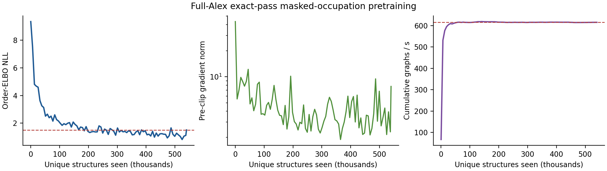

# Full-Alex masked-occupation pretraining v1

Status: **PASS**.

The selected hidden-256 assignment scorer completed one exact pass over all
539,983 eligible Alex-MP-20 training structures after excluding 181 Gold
parent-carrier rows.  Each structure supplied two independent target-free
reveal paths, for 1,079,966 graph-path exposures.  No graph was padded,
duplicated, or dropped.

Training order-ELBO NLL decreased from `9.345916` to `1.506007` (ratio
`0.161141`); all 4,219 gradient updates were finite.  Two RTX 4090 cards
(physical devices 1 and 3) processed `614.67 graphs/s` with `4,641.67 MiB`
peak allocated memory per rank.  Every frozen execution check passed.

The final checkpoint is retained on the laboratory server at
`/home/workspace/lrh/runs/h1a_assignment_full_alex_pretraining_v1/checkpoint.pt`
with SHA-256
`0d17cfc8f091f5624fd46d6b03d84cdfe01fcbcda98a59d8d711d5b0d64f5d47`.
It was selected at the final exact-pass update without reading any Gold fit,
calibration, or test target.

This is broad representation pretraining, not a pass of
`p(A | C, O_parent)`.  It authorizes parent-conditioned IID fine-tuning and
evaluation only; `p(N)`, lattice, generated-side coordinates, joint generation,
tensor conditioning, relaxation, DFT, and DFPT remain blocked.

