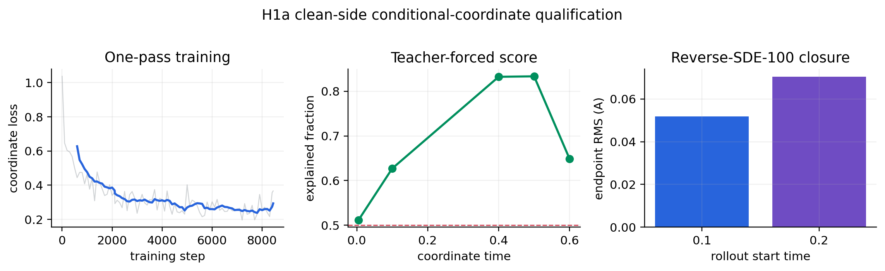

# H1a current-backbone clean-side coordinate qualification

This single-seed, exact-one-pass Gate requalifies only
`p(F | A_clean, L_clean, N)` in the current separate-clock production
backbone. It does not change the archived free-joint H1a failure.

## Frozen run

- Protocol: `configs/gates/h1a_coordinate_clean_side_current_v1.json`
- Seed: `5705`
- Exposure: `540,164` graphs, `8,441` updates, batch size `64`
- Coordinate clock: sampled; element and lattice clocks: exactly zero
- Model: `5,462,191` parameters, BF16 activations with FP32 geometry
- Hardware: RTX 4090
- Checkpoint SHA-256:
  `fbede266e8db4d96fb33ce0bb1b902c6f0716fc181d31c1c1b24434bef0ab895`
- Result SHA-256:
  `204ad2f1e9b3c7480f09826b2e7848f836c150ed2f44002c46773fc05d990392`

## Result

Every preregistered check passed:

| metric | observed | frozen requirement |
|---|---:|---:|
| validation coordinate ratio | 0.29798 | <= 0.46382 |
| improvement over reference | 0.19584 | >= 0.03 |
| t=0.005 endpoint RMS | 0.03626 A | <= 0.04 A |
| t=0.1 endpoint RMS | 0.04751 A | <= 0.08 A |
| t=0.6 explained fraction | 0.64857 | >= 0.50 |
| rollout RMS from t=0.1 | 0.05177 A | <= 0.50 A |
| rollout RMS from t=0.2 | 0.07040 A | <= 1.00 A |
| throughput | 499.22 graphs/s | >= 220 graphs/s |
| peak allocated memory | 4,975.19 MiB | <= 5,500 MiB |
| sampling failures | 0 | 0 |

The first evaluation attempt failed closed before score evaluation because a
legacy shared-clock evaluator omitted explicit element and lattice clocks for
the separate-clock model. The evaluator now derives both side clocks from the
checkpoint's recorded `coordinate_clean_side_information` contract. Regression
tests cover clean-side zero clocks and joint matching clocks; no model weights,
data, thresholds, or metrics changed.

The next authorized experiment is the separately frozen generated-side
assignment/lattice coordinate exposure panel. Full-from-prior coordinate
generation, joint M1, tensor conditioning, relaxation, DFT, and DFPT remain
unqualified.

