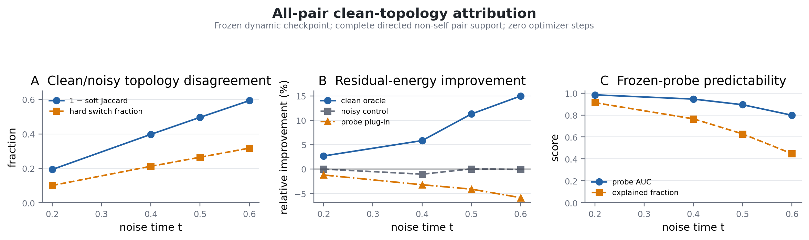
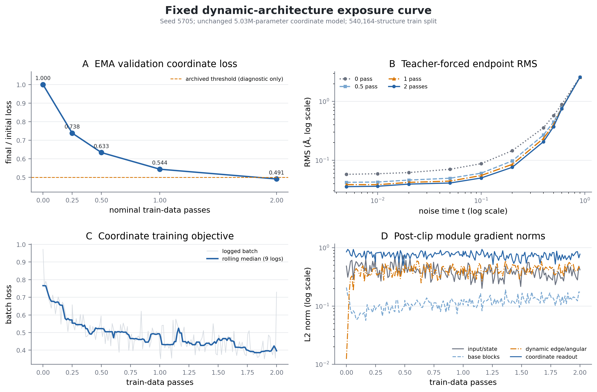

# H1a noisy-graph substrate diagnosis: topology attribution and fixed-architecture exposure curve

## Technical summary

The combined evidence closes two feature-expansion directions but does not yet identify a single production repair. Stronger aggregation on the current noisy radius graph failed to produce material improvement, and two independently implemented low-frequency reciprocal probes were negative. A complete all-pair audit then showed that the graph itself is substantially corrupted at middle noise and that clean coordination contains residual information: the clean-topology oracle improves middle-noise residual energy by 10.72%, while the current noisy-topology control changes it by -0.35%. The frozen hidden state predicts the clean field well (middle-noise AUC 0.879; explained fraction 0.614), but a naive probe-weighted plug-in worsens the residual by 4.39%. Predictability therefore does not establish a valid correction field.

The unchanged 5.03M-parameter dynamic coordinate model was subsequently trained from scratch for exactly two full passes over all 540,164 training structures. Its one-pass validation ratio 0.543705 reproduced the archived 0.544167 result. The two-pass ratio fell to 0.491033, a 9.6876% relative improvement from one pass. This lies between the preregistered plateau threshold (at most 5%) and undertraining threshold (at least 10%), so the formal result is **ambiguous**. It rejects a clear one-pass representation plateau but does not authorize further passes, a topology production branch, H1b, tensor conditioning, or any downstream oracle/DFT work.

## Clean topology is informative, but the frozen plug-in is not a causal correction

At middle noise, clean and noisy coordination disagree materially: mean soft Jaccard is 0.504 and the hard edge-switch fraction is 0.265. Unlike the invalid v1 audit, the v2 all-pair support covers 100% of clean coordination mass. The clean oracle helps at all three preregistered middle times and reaches 15.0% residual-energy improvement at `t=0.6`. The current noisy topology is neutral, while replacing the oracle weights by frozen probe probabilities reverses the sign of the improvement.

This separates three claims that must not be conflated:

1. Clean coordination is not recoverable from the noisy radius graph alone: supported.
2. The current hidden state contains predictive information about clean coordination: supported.
3. Frozen clean-edge probabilities can be inserted as a linear residual carrier: rejected.

The negative third result is compatible with topology being useful under joint training, because the optimal residual direction need not be the oracle carrier fitted under exact labels, and probability calibration errors can rotate the aggregate vector even when pairwise AUC is high. It does, however, prohibit direct production integration without another causal qualification.

## A second data pass still improves the unchanged model, but narrowly misses the undertraining rule

The fixed exposure curve uses one seed, one initialization, one data order, one optimizer, and one EMA trajectory. Checkpoints were saved at nominal 0, 0.25, 0.5, 1, and 2 passes. The validation panel contains 256 fixed held-out structures with common random numbers; no checkpoint was selected post hoc.

| Nominal passes | Graph presentations | EMA validation loss | Final / initial |
|---:|---:|---:|---:|
| 0 | 0 | 0.971804 | 1.000000 |
| 0.25 | 135,104 | 0.717551 | 0.738371 |
| 0.5 | 270,144 | 0.615620 | 0.633482 |
| 1 | 540,164 | 0.528375 | 0.543705 |
| 2 | 1,080,328 | 0.477188 | 0.491033 |

The one-to-two-pass relative improvement is

\[
\frac{0.528375-0.477188}{0.528375}=0.096876.
\]

This is 0.3124 percentage points below the frozen 10% undertraining boundary and 4.6876 percentage points above the 5% plateau boundary. The curve therefore supplies evidence for continued optimization but cannot be discretized honestly into either preregistered endpoint class. Crossing the archived ratio 0.5 line at two passes is post-hoc context only; this diagnostic did not rerun the complete historical H1a acceptance set and does not change the archived failed Gate.

Teacher-forced endpoint RMS also improves from one to two passes at low and middle noise: `t=0.005` changes from 0.03835 Å to 0.03546 Å, `t=0.1` from 0.05484 Å to 0.04980 Å, and `t=0.5` from 0.40305 Å to 0.37155 Å. The `t=0.9` value remains essentially unchanged (2.5803 Å versus 2.5895 Å), consistent with the high-noise wrapped state carrying little endpoint-specific information. That high-noise point is diagnostic and is not used as a failure criterion.

## Scope, data, and metric definitions

- **Data:** the qualified Alex-MP-20 P1 structure cache, with 540,164 train and 67,520 validation structures. This experiment reads only the train split for optimization and a fixed 256-structure validation panel for comparison.
- **Coordinate objective:** translation-quotient denoising score matching in the volume-normalized Cartesian tangent chart, with the production wrapped-torus probability path.
- **Validation ratio:** fixed-noise EMA validation coordinate loss at a checkpoint divided by the untrained checkpoint loss.
- **Relative one-to-two-pass improvement:** the one-pass validation loss minus the two-pass validation loss, divided by the one-pass validation loss.
- **Clean topology:** a smooth first-shell probability on every directed non-self atom pair, using exact periodic closest-image distances and complete `N(N-1)` support.
- **Residual-energy improvement:** the reduction in coordinate score residual MSE after a frozen linear carrier is fitted on the preregistered train panel and evaluated on the held-out panel.
- **Probe predictability:** held-out pairwise AUC and explained fraction from a zero-optimizer ridge probe over frozen node/edge states.

## Experimental design and implementation checks

The all-pair topology audit performs zero optimizer steps and verifies that the source checkpoint parameter hash is unchanged. It uses every directed non-self pair (`N<=20`, hence at most 380 directed pairs), exact float64 periodic CVP for labels, and a fixed-temperature mixture over production periodic images for features. Clean, noisy, and learned carriers share the same feature design and fitting rule.

The exposure experiment trains the existing dynamic persistent-edge model from scratch for exactly 16,882 optimizer steps with batch size 64, corresponding to two complete split passes and 1,080,328 graph presentations. Checkpoints at steps 2,111 and 4,221 are batch-quantized approximations to one-quarter and one-half pass; steps 8,441 and 16,882 are exact full-pass boundaries. Training ran on a 16GB RTX 4060 Ti under PyTorch 2.5.1+cu124. Median steady throughput was approximately 240 graphs/s, and the maximum allocated CUDA memory recorded by the trainer was 5,251 MiB.

Every logged coordinate-related module remained active through the second pass. At the two-pass checkpoint, post-clip gradient norms were 0.418 for input/state embeddings, 0.173 for base message blocks, 0.436 for dynamic edge/angular modules, and 0.778 for the coordinate readout. Element and lattice heads had exactly zero gradient, as required by the coordinate-only objective. The small tensor-atlas-group gradient belongs to the null-condition token; the tensor-free path creates zero atlas candidates.

## Limitations, uncertainty, and robustness

- The exposure classification uses one preregistered seed to conserve iteration cost. It does not estimate between-seed uncertainty; 9.6876% should not be rounded into a 10% pass.
- The two-pass run is diagnostic, not a retroactive H1a rerun. It omits the complete historical sampler and distribution acceptance suite.
- The topology oracle is a causal attribution only for the tested frozen linear carrier family. It does not prove that a learned nonlinear topology-conditioned vector field will help free sampling.
- The probe's high AUC does not guarantee calibrated probabilities or vector-field alignment. Its negative plug-in result is the direct evidence for this limitation.
- TopK, induced slots, low-frequency reciprocal carriers, and additional angular rank are not reopened by this result.

## Recommended next bounded audit

Do not add a production topology branch or another training pass. Run one zero-training **exposure-conditioned topology residual persistence audit** on the already frozen 0.25/0.5/1/2-pass checkpoints, using the exact v2 all-pair panels and carrier definitions. Measure whether clean-oracle residual improvement monotonically disappears as the base model receives more data exposure.

- If oracle gain falls near zero by two passes, treat noisy-topology residual as largely an optimization/data-exposure effect and focus on parameterization or training efficiency.
- If oracle gain remains at least 10% while validation improves, the topology residual is persistent and can justify a separately frozen jointly trained topology-head/residual-field proposal.
- If probe predictability changes materially across checkpoints, distinguish representation learning from probability calibration before proposing any production mechanism.

This audit requires no optimizer step, no new seed, no new data split, and no tensor condition. It is the smallest experiment that resolves the present ambiguity without spending another full training cycle.

## Further questions

1. Does the clean-oracle gain persist after two passes, or was it partially absorbed by the existing dynamic model?
2. Is the negative probe plug-in caused by probability calibration, by carrier-direction mismatch, or by an interaction with translation projection?
3. Can any future topology mechanism demonstrate added residual causality before joint training, rather than relying on pairwise AUC alone?
