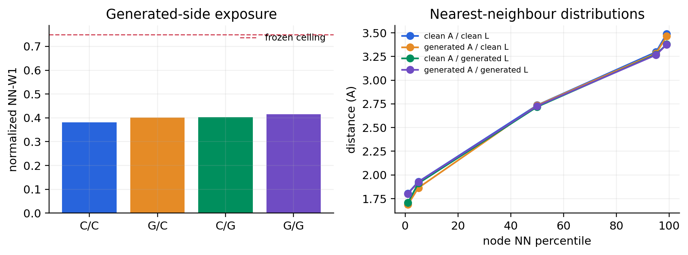

# H1a generated-side coordinate exposure Gate

This Gate evaluates full reverse-SDE-100 coordinate rollouts on 18
supported-IID parent-carrier materials under a common coordinate prior and
common Brownian path. The four arms independently replace the clean assignment
and lattice by samples from the qualified Q1 and L1 laws.

The protocol and thresholds were committed before the first trajectory was
sampled. Three earlier invocations failed closed before sampling because of a
script import boundary, a cross-platform raw-JSON hash, and a compiled feature
width mismatch. Those fixes did not expose trajectory metrics or alter any
threshold.

## Result

All frozen checks pass.

| arm | normalized node NN-W1 | valid graph minimum-distance fraction |
|---|---:|---:|
| clean assignment / clean lattice | 0.38042 | 1.0 |
| generated assignment / clean lattice | 0.40121 | 1.0 |
| clean assignment / generated lattice | 0.40345 | 1.0 |
| generated assignment / generated lattice | 0.41566 | 1.0 |

The additive W1 degradations relative to clean/clean are `0.02079` for
assignment, `0.02303` for lattice, and `0.03525` jointly. Assignment sampling
preserves every composition exactly. Generated lattices are finite and
right-handed, every coordinate trajectory is finite, and there are zero
sampling failures. Reordering the same composition changes the generated
lattice by at most `1.01e-6`, below the frozen `1e-5` limit.

Result SHA-256:
`852825d8ab34e10a9fc536e6e262ec4ce78e84723dbaa66b5093d07f47ac7013`.

This qualifies only the bounded supported-IID, oracle-composition side-state
exposure. It authorizes the GaugeFlow-base capacity screen, not generated
composition, unseen parent actions, free joint M1, tensor conditioning,
relaxation, DFT, or DFPT.

