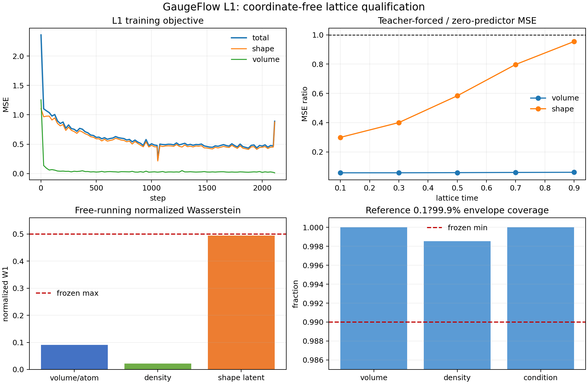

# H1a lattice L1 v1

Status: **PASS**.

This Gate qualifies only the flexible-cell P1 law

\[
p(L\mid C,N,P1),
\]

with a clean unordered composition. It does not qualify a parent crystal-family
projector, generated composition, generated-side coordinates, joint M1, tensor
conditioning, relaxation, DFT, or DFPT.

## Frozen run

- model implementation: `43361368635bdd1ff276e5e087ec742a3ee068e2`
- training/protocol checkout: `6d338c071`
- evaluator checkout: `cecf6e45b`
- protocol canonical SHA-256:
  `2ebd4f7ba9c363dc9c281d8c31597d2ba0e6e16f23b3867a388c7810f0d33596`
- seed: `5705`
- exposure: exactly two train passes, 1,080,328 graph presentations and 2,112 updates
- evaluation: 4,096 independently selected validation structures
- sampler: 100-step reverse SDE on the cosine VP lattice path
- device: one NVIDIA GeForce RTX 4090
- checkpoint SHA-256:
  `ef77ff14d10c88a03a7b034a6bebb106e53df37ecbbcd910e275c65dd416c04e`

## Results

| Check | Result | Frozen bound |
|---|---:|---:|
| aggregate teacher volume MSE ratio | 0.05823 | <= 0.75 |
| aggregate teacher shape MSE ratio | 0.60711 | <= 0.85 |
| t=0.5 teacher volume MSE ratio | 0.05793 | <= 0.60 |
| t=0.5 teacher shape MSE ratio | 0.58339 | <= 0.70 |
| free volume/atom normalized W1 | 0.09057 | <= 0.50 |
| free density normalized W1 | 0.02201 | <= 0.50 |
| free mean shape-latent normalized W1 | 0.49417 | <= 0.50 |
| minimum reference-envelope coverage | 0.99854 | >= 0.99 |
| finite positive lattices | 4096/4096 | 100% |
| sampling failures | 0 | 0 |
| deterministic replay max abs | 0 | 0 |
| full coordinate-geometry forwards | 0 | 0 |
| tensor-atlas forwards | 0 | 0 |
| median training throughput | 11,929.8 graphs/s | >= 500 |
| peak allocated training memory | 80.71 MiB | <= 2,500 MiB |

The free shape distribution is the limiting result: `0.49417` is close to the
pre-registered `0.50` boundary. L1 therefore passes, but the result does not
justify describing shape generation as solved with a wide margin. Generated-side
coordinate testing must retain explicit lattice-error stratification.

The final training update contained only four graphs and produced the visible
loss spike in the diagnostic. It was retained exactly as specified; its gradient
was clipped by the frozen global norm. No extra update, seed, or threshold change
was made.

