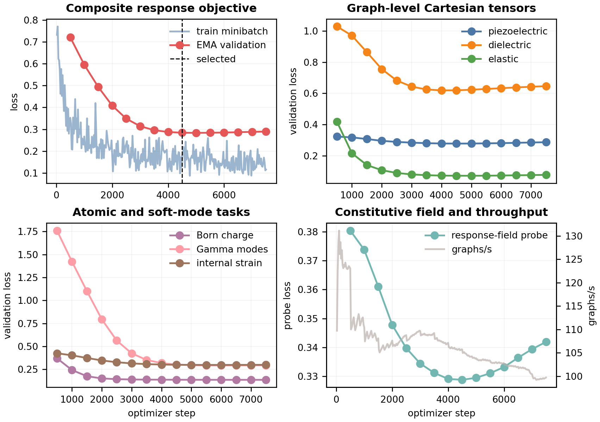

# Stage-D independent response model

The formal baseline run completed on one RTX 4090 and stopped at update 7,500
after the declared validation patience was exhausted.  The selected EMA
checkpoint is update 4,500.  It is initialized from the operational Stage-C
checkpoint at global step 40,523, but its response heads and held-out test
panel are independent of all Stage-E generator outputs.

The selected checkpoint SHA-256 is
`67dd8e8a4624fe87b6df2bc2580adfe04b777dfbad001102e7ecb2f6059a8497`.

| Metric | Validation | Test |
|---|---:|---:|
| Composite loss | 0.284270 | 0.256640 |
| Piezoelectric Cartesian tensor | 0.277958 | 0.249202 |
| Lossless response-field probes | 0.328824 | 0.294194 |
| Dielectric | 0.619153 | 0.522682 |
| Elastic | 0.071932 | 0.059267 |
| Born effective charge | 0.136081 | 0.106917 |
| Gamma soft modes | 0.301408 | 0.329163 |
| Internal strain | 0.299088 | 0.272606 |

The earlier paired D0 screen found that an additional response-probe loss was
redundant with the complete Cartesian tensor target, so the formal model keeps
the unmodified multi-task baseline.  Validation improves rapidly through
roughly 4,000--4,500 updates and then shows a small, persistent reversal; the
early stop therefore prevents fitting the limited response corpus further.

The result qualifies this checkpoint only as the independent Stage-D response
evaluator.  It does not itself establish tensor-conditioned generation,
relaxation retention, DFT/DFPT agreement, or materials discovery.
